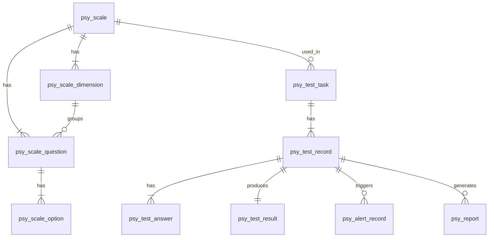

## 1. Architecture Design

```mermaid
graph TB
    subgraph "Frontend Layer"
        A[Vue 3 + Ant Design Vue]
        subgraph "Components"
            A1[量表管理组件]
            A2[测评答题组件]
            A3[报告展示组件]
            A4[预警中心组件]
        end
    end
    
    subgraph "Backend Layer"
        B[Express.js Server]
        subgraph "Services"
            B1[AI Service]
            B2[Scale Service]
            B3[Testing Service]
            B4[Report Service]
            B5[Alert Service]
        end
    end
    
    subgraph "Data Layer"
        C[(SQLite Database)]
        subgraph "Tables"
            C1[psy_scale]
            C2[psy_scale_dimension]
            C3[psy_scale_question]
            C4[psy_scale_option]
            C5[psy_test_task]
            C6[psy_test_record]
            C7[psy_test_answer]
            C8[psy_test_result]
            C9[psy_alert_rule]
            C10[psy_alert_record]
        end
    end
    
    subgraph "AI Services"
        D[Mock AI Engine]
    end
    
    A --&gt;|API Calls| B
    B --&gt;|Data Operations| C
    B --&gt;|AI Requests| D
```

## 2. Technology Description
- 前端：Vue@3 + Ant Design Vue@4 + Vite@6
- 初始化工具：vite-init
- 后端：Express@4 + TypeScript
- 数据库：SQLite（轻量级，适合开发和演示）
- AI 服务：内置 Mock 引擎（可替换为真实 LLM）

## 3. Route Definitions

| Route | Purpose |
|-------|---------|
| / | 首页（仪表板） |
| /ai/scale-generate | AI 量表生成页面 |
| /scale | 量表管理页面 |
| /scale/:id | 量表详情页面 |
| /testing | 施测任务页面 |
| /testing/take/:taskId | 学生测评页面 |
| /report/:recordId | AI 报告生成和预览页面 |
| /alert | 预警中心页面 |
| /profile | 学生档案页面 |

## 4. API Definitions

### 4.1 Type Definitions

```typescript
// Scale related types
interface Scale {
  id: number;
  name: string;
  category: string;
  source: 'BUILTIN' | 'CUSTOM' | 'AI_GENERATED';
  status: 'DRAFT' | 'PUBLISHED' | 'DISABLED';
  description?: string;
  createdAt: Date;
}

interface ScaleDimension {
  id: number;
  scaleId: number;
  name: string;
  code: string;
  description?: string;
}

interface ScaleQuestion {
  id: number;
  scaleId: number;
  dimensionId?: number;
  questionNo: number;
  questionType: 'SINGLE_CHOICE' | 'MULTIPLE_CHOICE' | 'TEXT';
  stem: string;
  isReverse: boolean;
}

interface ScaleOption {
  id: number;
  questionId: number;
  optionLabel: string;
  optionText: string;
  score: number;
}

// Testing related types
interface TestTask {
  id: number;
  scaleId: number;
  name: string;
  startTime: Date;
  endTime?: Date;
  status: 'DRAFT' | 'ACTIVE' | 'COMPLETED';
  targetConfig?: any;
}

interface TestRecord {
  id: number;
  taskId: number;
  studentId: string;
  status: 'IN_PROGRESS' | 'COMPLETED';
  startTime: Date;
  endTime?: Date;
  durationSec?: number;
}

interface TestAnswer {
  id: number;
  recordId: number;
  questionId: number;
  questionNo: number;
  answerValue: string;
  rawScore?: number;
}

interface TestResult {
  id: number;
  recordId: number;
  totalScore: number;
  standardScore?: number;
  dimensionScores: any;
  severityLevel: 'LOW' | 'MEDIUM' | 'HIGH' | 'SEVERE';
  alertTriggered: boolean;
  aiAnalysis?: string;
  createdAt: Date;
}

// Alert related types
interface AlertRecord {
  id: number;
  studentId: string;
  alertLevel: 'LOW' | 'MEDIUM' | 'HIGH' | 'SEVERE';
  triggerData?: any;
  aiAnalysis?: string;
  isRead: boolean;
  isHandled: boolean;
  handleComment?: string;
  createdAt: Date;
}

// Report related types
interface Report {
  id: number;
  recordId: number;
  reportType: 'STUDENT' | 'PARENT' | 'TEACHER' | 'SCHOOL';
  reportData: any;
  reportContent: string; // HTML
  aiGenerated: boolean;
  createdAt: Date;
}
```

### 4.2 API Endpoints

#### Scale APIs
- `GET /api/scale` - 获取量表列表
- `POST /api/scale` - 创建新量表
- `GET /api/scale/:id` - 获取量表详情
- `PUT /api/scale/:id` - 更新量表
- `POST /api/scale/:id/publish` - 发布量表
- `POST /api/scale/:id/disable` - 禁用量表

#### AI Scale Generation APIs
- `POST /api/ai/scale/generate` - AI 生成量表
- `POST /api/ai/scale/preview` - 预览 AI 生成的量表

#### Testing APIs
- `GET /api/testing/task` - 获取施测任务列表
- `POST /api/testing/task` - 创建施测任务
- `GET /api/testing/task/:id` - 获取任务详情
- `GET /api/testing/task/:id/records` - 获取任务的答题记录
- `POST /api/testing/take/:taskId/start` - 开始测评
- `POST /api/testing/take/:recordId/answer` - 提交答案
- `POST /api/testing/take/:recordId/submit` - 提交测评

#### Report APIs
- `POST /api/ai/report/generate` - AI 生成报告
- `GET /api/report/:recordId` - 获取报告

#### Alert APIs
- `GET /api/alert` - 获取预警列表
- `PUT /api/alert/:id/read` - 标记为已读
- `PUT /api/alert/:id/handle` - 处理预警

#### AI Anomaly Detection APIs
- `POST /api/ai/anomaly/detect` - AI 异常检测

## 5. Server Architecture Diagram

```mermaid
graph TB
    subgraph "Controller Layer"
        A1[ScaleController]
        A2[TestingController]
        A3[ReportController]
        A4[AlertController]
        A5[AIController]
    end
    
    subgraph "Service Layer"
        B1[ScaleService]
        B2[TestingService]
        B3[ReportService]
        B4[AlertService]
        B5[AIService]
    end
    
    subgraph "Data Layer"
        C1[ScaleRepository]
        C2[TestingRepository]
        C3[ReportRepository]
        C4[AlertRepository]
    end
    
    subgraph "Database"
        D[(SQLite)]
    end
    
    A1 --&gt; B1
    A2 --&gt; B2
    A3 --&gt; B3
    A4 --&gt; B4
    A5 --&gt; B5
    
    B1 --&gt; C1
    B2 --&gt; C2
    B3 --&gt; C3
    B4 --&gt; C4
    
    C1 --&gt; D
    C2 --&gt; D
    C3 --&gt; D
    C4 --&gt; D
```

## 6. Data Model

### 6.1 Data Model Definition



### 6.2 Data Definition Language

```sql
-- Scale tables
CREATE TABLE psy_scale (
    id INTEGER PRIMARY KEY AUTOINCREMENT,
    name TEXT NOT NULL,
    category TEXT NOT NULL,
    source TEXT NOT NULL CHECK (source IN ('BUILTIN', 'CUSTOM', 'AI_GENERATED')),
    status TEXT NOT NULL DEFAULT 'DRAFT' CHECK (status IN ('DRAFT', 'PUBLISHED', 'DISABLED')),
    description TEXT,
    psychometric_status TEXT DEFAULT 'DRAFT' CHECK (psychometric_status IN ('DRAFT', 'PILOT_TESTED', 'VALIDATED', 'NORMED')),
    created_at DATETIME DEFAULT CURRENT_TIMESTAMP,
    updated_at DATETIME DEFAULT CURRENT_TIMESTAMP
);

CREATE TABLE psy_scale_dimension (
    id INTEGER PRIMARY KEY AUTOINCREMENT,
    scale_id INTEGER NOT NULL,
    code TEXT NOT NULL,
    name TEXT NOT NULL,
    description TEXT,
    scoring_formula TEXT,
    severity_levels TEXT, -- JSON
    created_at DATETIME DEFAULT CURRENT_TIMESTAMP,
    FOREIGN KEY (scale_id) REFERENCES psy_scale(id)
);

CREATE TABLE psy_scale_question (
    id INTEGER PRIMARY KEY AUTOINCREMENT,
    scale_id INTEGER NOT NULL,
    dimension_id INTEGER,
    question_no INTEGER NOT NULL,
    question_type TEXT NOT NULL DEFAULT 'SINGLE_CHOICE' CHECK (question_type IN ('SINGLE_CHOICE', 'MULTIPLE_CHOICE', 'TEXT')),
    stem TEXT NOT NULL,
    is_reverse BOOLEAN DEFAULT 0,
    ai_suggestion TEXT,
    created_at DATETIME DEFAULT CURRENT_TIMESTAMP,
    FOREIGN KEY (scale_id) REFERENCES psy_scale(id),
    FOREIGN KEY (dimension_id) REFERENCES psy_scale_dimension(id)
);

CREATE TABLE psy_scale_option (
    id INTEGER PRIMARY KEY AUTOINCREMENT,
    question_id INTEGER NOT NULL,
    option_label TEXT NOT NULL,
    option_text TEXT NOT NULL,
    score REAL NOT NULL,
    created_at DATETIME DEFAULT CURRENT_TIMESTAMP,
    FOREIGN KEY (question_id) REFERENCES psy_scale_question(id)
);

-- Testing tables
CREATE TABLE psy_test_task (
    id INTEGER PRIMARY KEY AUTOINCREMENT,
    scale_id INTEGER NOT NULL,
    name TEXT NOT NULL,
    task_type TEXT DEFAULT 'NORMAL',
    start_time DATETIME NOT NULL,
    end_time DATETIME,
    anonymity BOOLEAN DEFAULT 0,
    target_config TEXT, -- JSON
    status TEXT DEFAULT 'DRAFT' CHECK (status IN ('DRAFT', 'ACTIVE', 'COMPLETED')),
    created_at DATETIME DEFAULT CURRENT_TIMESTAMP,
    FOREIGN KEY (scale_id) REFERENCES psy_scale(id)
);

CREATE TABLE psy_test_record (
    id INTEGER PRIMARY KEY AUTOINCREMENT,
    task_id INTEGER NOT NULL,
    student_id TEXT NOT NULL,
    status TEXT DEFAULT 'IN_PROGRESS' CHECK (status IN ('IN_PROGRESS', 'COMPLETED')),
    start_time DATETIME DEFAULT CURRENT_TIMESTAMP,
    end_time DATETIME,
    duration_sec INTEGER,
    ai_flags TEXT, -- JSON
    created_at DATETIME DEFAULT CURRENT_TIMESTAMP,
    FOREIGN KEY (task_id) REFERENCES psy_test_task(id)
);

CREATE TABLE psy_test_answer (
    id INTEGER PRIMARY KEY AUTOINCREMENT,
    record_id INTEGER NOT NULL,
    question_id INTEGER NOT NULL,
    question_no INTEGER NOT NULL,
    answer_value TEXT NOT NULL,
    raw_score REAL,
    created_at DATETIME DEFAULT CURRENT_TIMESTAMP,
    FOREIGN KEY (record_id) REFERENCES psy_test_record(id),
    FOREIGN KEY (question_id) REFERENCES psy_scale_question(id)
);

CREATE TABLE psy_test_result (
    id INTEGER PRIMARY KEY AUTOINCREMENT,
    record_id INTEGER NOT NULL UNIQUE,
    total_score REAL NOT NULL,
    standard_score REAL,
    dimension_scores TEXT NOT NULL, -- JSON
    severity_level TEXT NOT NULL CHECK (severity_level IN ('LOW', 'MEDIUM', 'HIGH', 'SEVERE')),
    alert_triggered BOOLEAN DEFAULT 0,
    ai_analysis TEXT,
    created_at DATETIME DEFAULT CURRENT_TIMESTAMP,
    FOREIGN KEY (record_id) REFERENCES psy_test_record(id)
);

-- Alert tables
CREATE TABLE psy_alert_rule (
    id INTEGER PRIMARY KEY AUTOINCREMENT,
    alert_level TEXT NOT NULL CHECK (alert_level IN ('LOW', 'MEDIUM', 'HIGH', 'SEVERE')),
    rule_type TEXT NOT NULL,
    rule_config TEXT NOT NULL, -- JSON
    notify_roles TEXT NOT NULL, -- JSON
    cooldown_hours INTEGER DEFAULT 24,
    ai_enabled BOOLEAN DEFAULT 0,
    is_active BOOLEAN DEFAULT 1,
    created_at DATETIME DEFAULT CURRENT_TIMESTAMP
);

CREATE TABLE psy_alert_record (
    id INTEGER PRIMARY KEY AUTOINCREMENT,
    rule_id INTEGER,
    student_id TEXT NOT NULL,
    alert_level TEXT NOT NULL CHECK (alert_level IN ('LOW', 'MEDIUM', 'HIGH', 'SEVERE')),
    trigger_data TEXT, -- JSON
    ai_analysis TEXT,
    is_read BOOLEAN DEFAULT 0,
    is_handled BOOLEAN DEFAULT 0,
    handle_type TEXT,
    handle_comment TEXT,
    handle_result TEXT,
    created_at DATETIME DEFAULT CURRENT_TIMESTAMP,
    FOREIGN KEY (rule_id) REFERENCES psy_alert_rule(id)
);

-- Report tables
CREATE TABLE psy_report_template (
    id INTEGER PRIMARY KEY AUTOINCREMENT,
    report_type TEXT NOT NULL CHECK (report_type IN ('STUDENT', 'PARENT', 'TEACHER', 'SCHOOL', 'DISTRICT')),
    template_content TEXT NOT NULL,
    ai_prompt TEXT,
    ai_model_id TEXT,
    created_at DATETIME DEFAULT CURRENT_TIMESTAMP
);

CREATE TABLE psy_report (
    id INTEGER PRIMARY KEY AUTOINCREMENT,
    report_type TEXT NOT NULL,
    target_id TEXT,
    test_record_id INTEGER,
    report_data TEXT NOT NULL, -- JSON
    report_content TEXT NOT NULL, -- HTML
    ai_generated BOOLEAN DEFAULT 1,
    ai_model_id TEXT,
    created_at DATETIME DEFAULT CURRENT_TIMESTAMP,
    FOREIGN KEY (test_record_id) REFERENCES psy_test_record(id)
);

-- AI Generation Log table
CREATE TABLE psy_ai_generation_log (
    id INTEGER PRIMARY KEY AUTOINCREMENT,
    gen_type TEXT NOT NULL CHECK (gen_type IN ('SCALE_GEN', 'REPORT_GEN', 'ANOMALY')),
    model_id TEXT,
    input_prompt TEXT NOT NULL,
    output_content TEXT,
    token_used INTEGER,
    latency_ms INTEGER,
    is_accepted BOOLEAN DEFAULT 0,
    feedback TEXT,
    created_at DATETIME DEFAULT CURRENT_TIMESTAMP
);

-- Indexes
CREATE INDEX idx_scale_question_scale_id ON psy_scale_question(scale_id);
CREATE INDEX idx_scale_option_question_id ON psy_scale_option(question_id);
CREATE INDEX idx_test_record_task_id ON psy_test_record(task_id);
CREATE INDEX idx_test_record_student_id ON psy_test_record(student_id);
CREATE INDEX idx_test_answer_record_id ON psy_test_answer(record_id);
CREATE INDEX idx_test_result_record_id ON psy_test_result(record_id);
CREATE INDEX idx_alert_record_student_id ON psy_alert_record(student_id);
CREATE INDEX idx_alert_record_is_read ON psy_alert_record(is_read);
CREATE INDEX idx_alert_record_created_at ON psy_alert_record(created_at);
CREATE INDEX idx_report_test_record_id ON psy_report(test_record_id);
```

### 6.3 Initial Data

```sql
-- Insert default alert rules
INSERT INTO psy_alert_rule (alert_level, rule_type, rule_config, notify_roles, cooldown_hours, ai_enabled) VALUES
('LOW', 'SCORE_THRESHOLD', '{"minScore": 30, "maxScore": 50}', '["TEACHER"]', 24, 0),
('MEDIUM', 'SCORE_THRESHOLD', '{"minScore": 50, "maxScore": 70}', '["TEACHER", "COUNSELOR"]', 12, 0),
('HIGH', 'SCORE_THRESHOLD', '{"minScore": 70, "maxScore": 90}', '["COUNSELOR", "ADMIN"]', 6, 1),
('SEVERE', 'SCORE_THRESHOLD', '{"minScore": 90}', '["COUNSELOR", "ADMIN", "PARENT"]', 1, 1);

-- Insert sample scale (SCL-90 simplified)
INSERT INTO psy_scale (name, category, source, status, description, psychometric_status) VALUES
('SCL-90 简化版', '心理健康筛查', 'BUILTIN', 'PUBLISHED', '症状自评量表简化版，用于快速筛查心理健康状况', 'VALIDATED');

-- Insert dimensions
INSERT INTO psy_scale_dimension (scale_id, code, name, description) VALUES
(1, 'SOM', '躯体化', '身体不适感'),
(1, 'DEP', '抑郁', '抑郁情绪和症状'),
(1, 'ANX', '焦虑', '焦虑症状和感受'),
(1, 'HOS', '敌对', '敌对情绪和行为');

-- Insert sample questions
INSERT INTO psy_scale_question (scale_id, dimension_id, question_no, question_type, stem, is_reverse) VALUES
(1, 1, 1, 'SINGLE_CHOICE', '头痛', 0),
(1, 1, 2, 'SINGLE_CHOICE', '神经过敏，心中不踏实', 0),
(1, 2, 3, 'SINGLE_CHOICE', '对异性的兴趣减退', 0),
(1, 2, 4, 'SINGLE_CHOICE', '感到受骗，中了圈套或有人想抓住您', 0),
(1, 3, 5, 'SINGLE_CHOICE', '过分担忧', 0),
(1, 3, 6, 'SINGLE_CHOICE', '感到大多数人都不可信任', 0),
(1, 4, 7, 'SINGLE_CHOICE', '容易烦恼和激动', 0),
(1, 4, 8, 'SINGLE_CHOICE', '责怪别人制造麻烦', 0);

-- Insert options for each question
INSERT INTO psy_scale_option (question_id, option_label, option_text, score) VALUES
(1, '1', '没有', 0),
(1, '2', '很轻', 1),
(1, '3', '中等', 2),
(1, '4', '偏重', 3),
(1, '5', '严重', 4),
(2, '1', '没有', 0),
(2, '2', '很轻', 1),
(2, '3', '中等', 2),
(2, '4', '偏重', 3),
(2, '5', '严重', 4),
(3, '1', '没有', 0),
(3, '2', '很轻', 1),
(3, '3', '中等', 2),
(3, '4', '偏重', 3),
(3, '5', '严重', 4),
(4, '1', '没有', 0),
(4, '2', '很轻', 1),
(4, '3', '中等', 2),
(4, '4', '偏重', 3),
(4, '5', '严重', 4),
(5, '1', '没有', 0),
(5, '2', '很轻', 1),
(5, '3', '中等', 2),
(5, '4', '偏重', 3),
(5, '5', '严重', 4),
(6, '1', '没有', 0),
(6, '2', '很轻', 1),
(6, '3', '中等', 2),
(6, '4', '偏重', 3),
(6, '5', '严重', 4),
(7, '1', '没有', 0),
(7, '2', '很轻', 1),
(7, '3', '中等', 2),
(7, '4', '偏重', 3),
(7, '5', '严重', 4),
(8, '1', '没有', 0),
(8, '2', '很轻', 1),
(8, '3', '中等', 2),
(8, '4', '偏重', 3),
(8, '5', '严重', 4);
```
